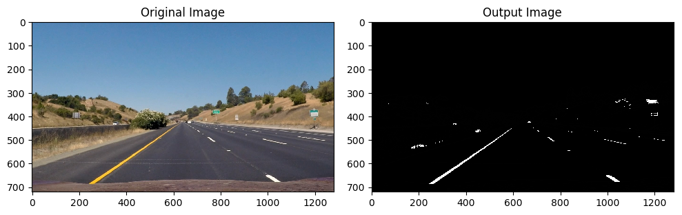
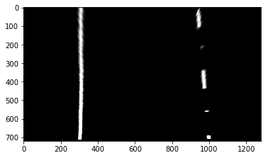
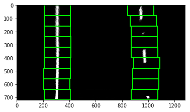
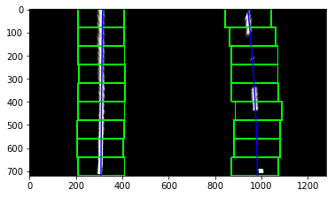

## Advanced Lane Finding

The Project
----

The goals / steps of this project are the following:

* Compute the camera calibration matrix and distortion coefficients given a set of chessboard images.
* Apply a distortion correction to raw images.
* Use color transforms, gradients, etc., to create a thresholded binary image.
* Apply a perspective transform to rectify binary image ("birds-eye view").
* Detect lane pixels and fit to find the lane boundary.
* Determine the curvature of the lane and vehicle position with respect to center.
* Warp the detected lane boundaries back onto the original image.
* Output visual display of the lane boundaries and numerical estimation of lane curvature and vehicle position.

Software Requirements
-------
     The project is done using python 3.6.2.
     OpenCV version 3.1.0 is used.
Python version less than 3.6.0 will not work properly because in my code I used f-string which is a new feature.

Folder Specification
-------
    1. The images for camera calibration are stored in the folder called camera_cal.  
    2. The images in test_images are for testing pipeline on single frames.
    3. The outputs after finding the chase board corner are in camera_cal_output.
    4. The binary outputs after color and gradient transformation of test_images 
       are in test_images_transformed folder.
    5. The binary outputs after bird's eye view perspective transform of test_images 
       are in test_images_wraped folder.
    6. The test_output folder contains all the test images after applying final pipeline function.
    7. Resources folder contains some images for purpose of writing README.md file.
    8. The output video after applying the pipeline to project_video.mp4 is output.mp4.

**Note**: All codes are self explanatory. Comments and function documentation has been given where needed.
          
#### Finding chess board corner
---

**The code for this step is contained in the fourth code cell of the IPython notebook advanced_lane_finding.ipynb.**

I start by preparing "object points", which will be the (x, y, z) coordinates of the chessboard corners in the world. Here I am assuming the chessboard is fixed on the (x, y) plane at z=0, such that the object points are the same for each calibration image.  Thus, `objp` is just a replicated array of coordinates, and `objpoints` will be appended with a copy of it every time `cv2.findChessboardCorners()` detects all chessboard corners in a test image.  `imgpoints` will be appended with the (x, y) pixel position of each of the corners in the image plane with each successful chessboard detection. 

Then draw the chess board corners by `cv2.drawChessboardCorners()`. Here is an example of chessboard corner drawn .

**Chess Board Corners**

#### Calibrating camera and calculation of camera matrix and distortion coefficients
`undistort_image()` function is used to undistort a image, the previous output `objpoints` and `imgpoints` have been used 
to compute the camera calibration and distortion coefficients using the `cv2.calibrateCamera()` function.  I applied this distortion correction to the input image using the `cv2.undistort()` function .

**Undistorted Chess board image**

### Pipeline (single images)
---

#### Example of distortion corrected image.

To demonstrate this step, I will describe how I apply the distortion correction to one of the test images like this one:

**Undistorted test image**

#### Applying gradient and color thresolding
I used a combination of color and gradient thresholds to generate a binary image .
       
        1. compute the scaled sobel with respect to x gradient then take a thresolding range b/w 20 and 100.
        2. Take the saturation space by converting the image from RGB to HLS space . Then applied a thresolding
           range b/w 170 and 255.

**Transformed image after applying gradient and color thresolding**

#### Perspective transformation and getting a birds eye view perspective

I used a `wrap()` function to get a birds eye view using perspective transform. It takes an image , source points and destination points and returns the wraped image transformation matrix and it's inverse .

| Source        | Destination   | 
|:-------------:|:-------------:| 
| 700, 460      | 950,0         |  
| 1140, 720     | 950, 720      |
| 200, 720      | 300, 720      |
| 580, 460      | 300, 0        |

I verified that my perspective transform was working as expected by drawing the `src` and `dst` points onto a test image and its warped counterpart to verify that the lines appear parallel in the warped image.

#### Finding lane line pixel and fitting polynomial

     1. Divide the thresolded binary transformed image into n=9 horizontal strips of equal height.
     2. Compute the histogram of each strip using np.sum().
     3. Identify two peaks where histogram computed are maximums.
     
**Birds eye view of a test transformed image and histogram drawn**

    
     4. Get the pixels in that horizontal strip that have x coordinates close to the two 
        peaks of x coordinates.

**Rectangles are drawn where lane line pixels are detected**

 
     5. Fit a second order polynomial to each lane line using np.polyfit() function.

**Polynomial fitted to birds-eye-view image**

#### Calculation of radius of curvature and vehicle position.

I did this in lines # through # in my code in `my_other_file.py`

#### Example on a test image.

The final `pipeline_func()` contains all the necessary steps for finding and plotting the lane lines. Here is an example of my result on a test image:

---

### Pipeline (video)
I applied my `image_pipeline()` function to the project_video. It detect's lane lines reasonably well but under a 
curved shadowed path it once showing some deviation.
**Here's the link of my [Output Video](./output.mp4)**

---

### Discussion
    This pipeline will not actually work rather than this project video. The source and destination 
    points have been chosen manually for birds eye view perspective transformation. Which indeed 
    is the most important step for finding lane line pixels.
    
    The color and gradient thresolding and identifying lane lines is a computing intensive work 
    and a maximum speed of 1.5 iteration/s achieved in these case will not work in realtime.
    
    But this pipeline detects lane lines moderately well on different colored , shaded highway path.
